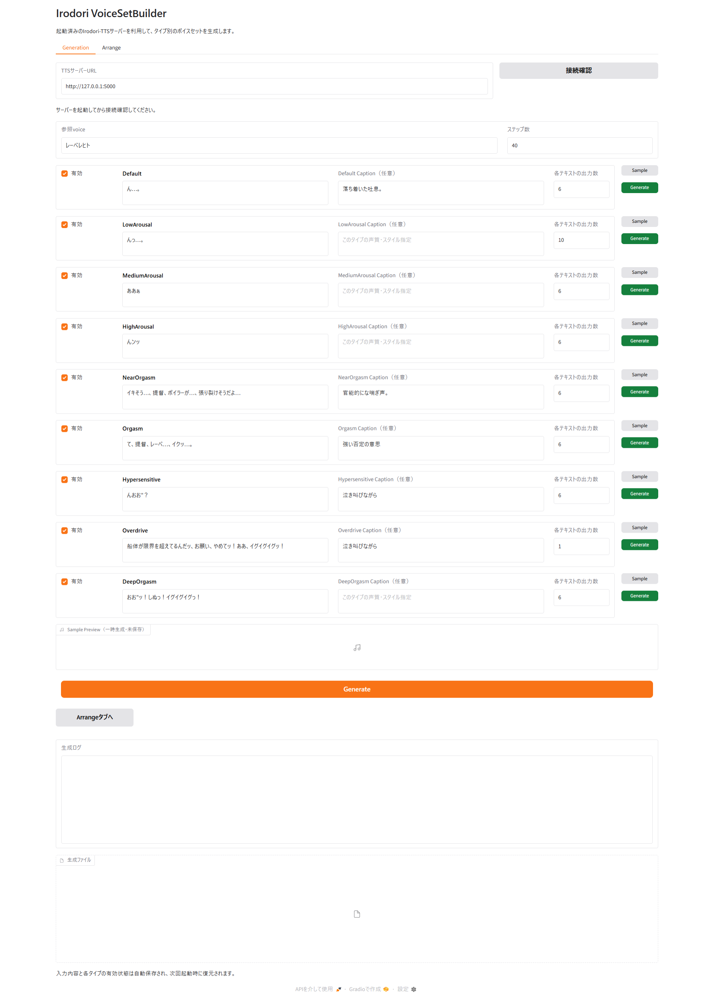
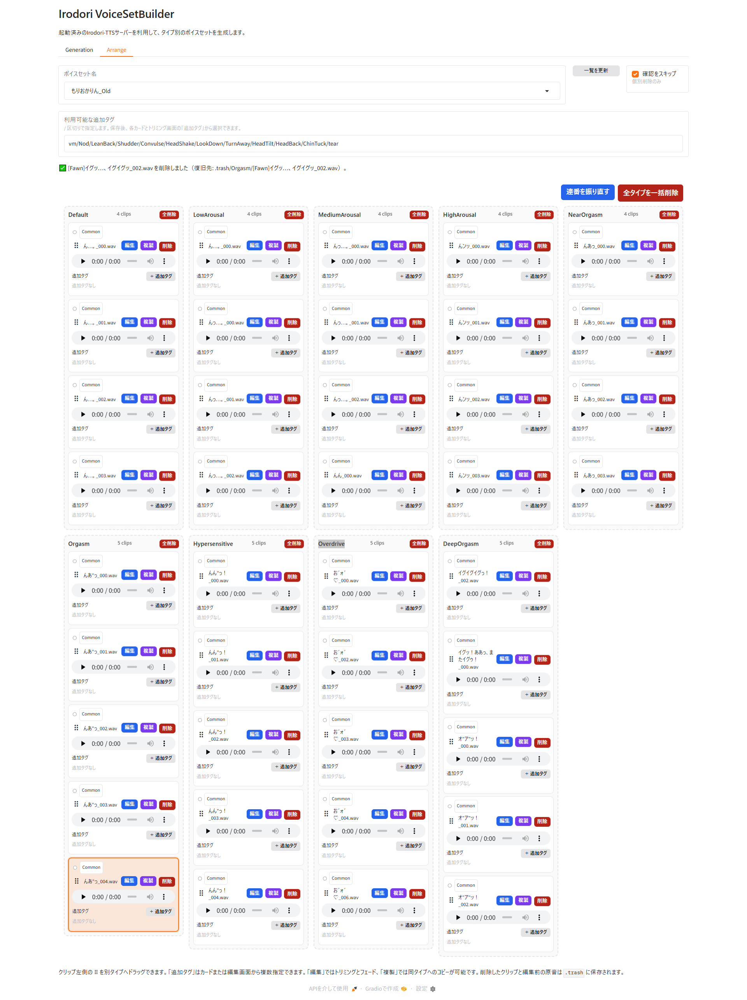

# MiRai Irodori Voice Set Builder Manual

English | [日本語](MANUAL.ja.md) | [Back to README](../README.en.md)

## 1. Overview

The Builder sends HTTP requests to a running MiRai Server for Irodori-TTS V4 and creates WAV voice sets organized by use or state.

It supports these nine types: `Default`, `LowArousal`, `MediumArousal`, `HighArousal`, `NearOrgasm`, `Orgasm`, `Hypersensitive`, `Overdrive`, and `DeepOrgasm`.

## 2. Preparation

### 2.1 Install uv

Follow the [official uv installation guide](https://docs.astral.sh/uv/getting-started/installation/), then verify it in a new command prompt:

```bat
uv --version
```

### 2.2 Prepare the Irodori-TTS server

Follow the README for [MiRai Server for Irodori-TTS V4](https://github.com/Snail921/MiRai-Server-for-Irodori-TTS-V4), then run `start_mirai_server.bat`.

The default server URL is `http://127.0.0.1:5000`. Open `http://127.0.0.1:5000/health` and confirm that the server responds. Reference voices belong in the TTS server's `voices` directory.

## 3. Starting and stopping the Builder

1. Double-click `Start_IrodoriVoiceSetBuilder.bat`.
2. On the first launch, wait for dependency setup to finish.
3. Your browser opens `http://127.0.0.1:7860` automatically.
4. To stop the Builder, press `Ctrl+C` in its command window.

If the browser does not open, visit the displayed URL manually. Closing the command window also stops the GUI.

## 4. Generation tab



### 4.1 Connect to the server

Enter the endpoint in **TTSサーバーURL** (TTS server URL), then click **接続確認** (Check connection). A successful check shows the number of voices and whether the runtime is loaded.

### 4.2 Shared fields

- **参照voice** (Reference voice): Enter an ID registered under the TTS server's `voices` directory. Matching is case-insensitive.
- **ステップ数** (Steps): Enter an integer from `1` through `120`. The default is `40`.

The Builder detects an unknown reference voice before generation. It also stops if the TTS server falls back to no-reference inference.

### 4.3 Fields for each type

- **有効** (Enabled): Include this type in the bottom batch Generate operation.
- **Text**: The text sent to TTS. Separate multiple phrases with `/`. Punctuation, commas, and line breaks are not separators.
- **Caption (optional)**: Describe voice quality, emotion, or delivery. No caption field is sent when this is blank.
- **各テキストの出力数** (Outputs per text): Choose how many clips to generate for every `/`-separated phrase.
- **Sample**: Generate one temporary candidate and play it in Sample Preview. Repeated clicks cycle through the phrases.
- **Generate**: Generate only this type immediately, regardless of its Enabled checkbox.

For example, `Good morning/Hello` with an output count of `3` produces six clips for that type.

### 4.4 Batch generation

Click the orange **Generate** button at the bottom and approve the confirmation dialog. Enabled types are processed sequentially from top to bottom. Do not close the server or Builder during generation.

After successful completion, the generation log and file list are shown, the Arrange shortcut is enabled, and the Arrange tab automatically selects the generated voice set.

### 4.5 Output layout and filenames

```text
output/<reference voice>/<type>/[Common]<text>_000.wav
```

If a filename already exists, the Builder chooses the next available number such as `_001` or `_002`; it never overwrites an existing clip. Characters that Windows does not allow in filenames are replaced with `_`. The text sent to TTS is not changed.

## 5. Arrange tab



### 5.1 Display a voice set

Choose a set under **ボイスセット名** (Voice set name). Click **一覧を更新** (Refresh list) after adding files outside the Builder. All types appear as card columns, and each clip can be played from its card.

### 5.2 Classification prefixes

Each clip can use `Common`, `Continue`, `EaseUp`, `Change`, `Stop`, or `Fawn`. The classification is stored as a filename prefix such as `[Common]` and represented by a colored marker on the card.

### 5.3 Additional tags

A fresh clone starts with these choices in **利用可能な追加タグ** (Available additional tags):

```text
vm/Nod/LeanBack/Shudder/Convulse/HeadShake/LookDown/TurnAway/HeadTilt/HeadBack/ChinTuck/tear
```

To change the choices, enter `/`-separated tags. Assign one or more through **追加タグ** (Additional tags) on a card or through the edit dialog. Tags are stored in the filename, for example `[HeadShake]`.

### 5.4 Edit a clip

Click **編集** (Edit) to open the trimming interface. You can change the display filename, classification prefix, additional tags, start and end positions, and fade-in and fade-out durations. The selected range can be previewed.

`.wav` is added if the extension is omitted. If the requested name already exists, the Builder suggests an available numbered name. The original audio is backed up under `.trash/edits/<type>/` before editing.

### 5.5 Duplicate, move, and delete

- **複製** (Duplicate): Copy the clip within the same type and allocate an available number.
- **Move**: Drag the handle on the left side of a card to another type column. A collision is resolved by automatic renaming.
- **削除** (Delete): After confirmation, move the file to `.trash/<original type>/`. It is not permanently erased.
- **全削除** (Delete all): Move every clip in that type to `.trash`.
- **全タイプを一括削除** (Delete all types): Move every clip in the selected voice set to `.trash`.

**確認をスキップ** (Skip confirmation) applies only to individual card deletion. Bulk deletion still requires confirmation.

### 5.6 Renumber clips

**連番を振り直す** (Renumber) processes all types and numbers each base text from `_000`, excluding classification and additional tags from the grouping key. It also normalizes missing or duplicated suffixes and adds `[Common]` to unclassified files.

## 6. Automatically saved settings

The TTS server URL, reference voice, step count, type inputs, available tags, and delete-confirmation preference are stored in `settings.json` and restored on the next launch.

`settings.json` and `output/` are excluded from Git. To restore defaults, stop the Builder and delete `settings.json`.

## 7. Troubleshooting

### `uv was not found in PATH`

Install uv, then reopen Explorer or the command prompt. Verify the installation with `uv --version`.

### The Builder cannot connect to the TTS server

- Confirm that server startup has completed.
- Open `http://127.0.0.1:5000/health` in a browser.
- If the server port was changed, update the URL in the GUI.
- For a server on another computer, use its LAN address and check its firewall settings.

### The reference voice cannot be found

Open `http://127.0.0.1:5000/voices` and copy the displayed `id` into the reference voice field.

### Port 7860 is already in use

```powershell
$env:IRODORI_BUILDER_PORT = "7861"
uv run --locked python app.py
```

### Generation stops partway through

Completed clips remain on disk. Check the displayed error and TTS server log, correct the problem, and run generation again. Existing files are preserved.
